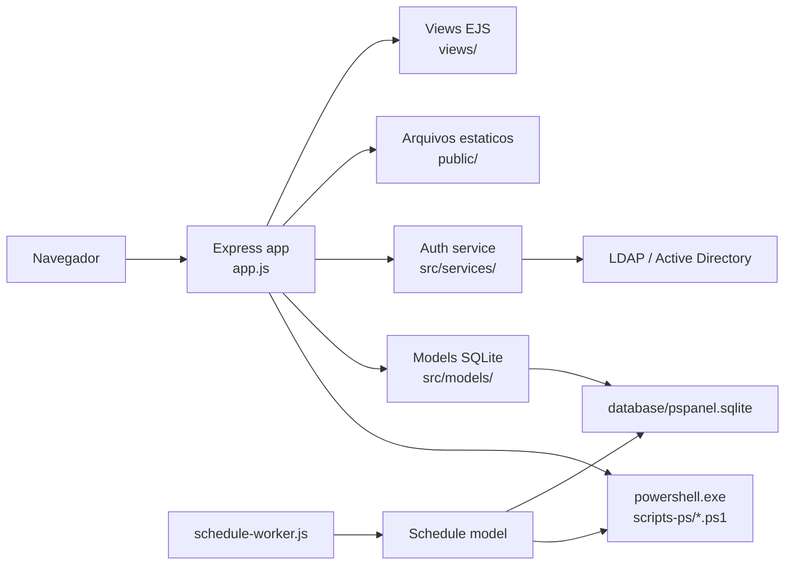
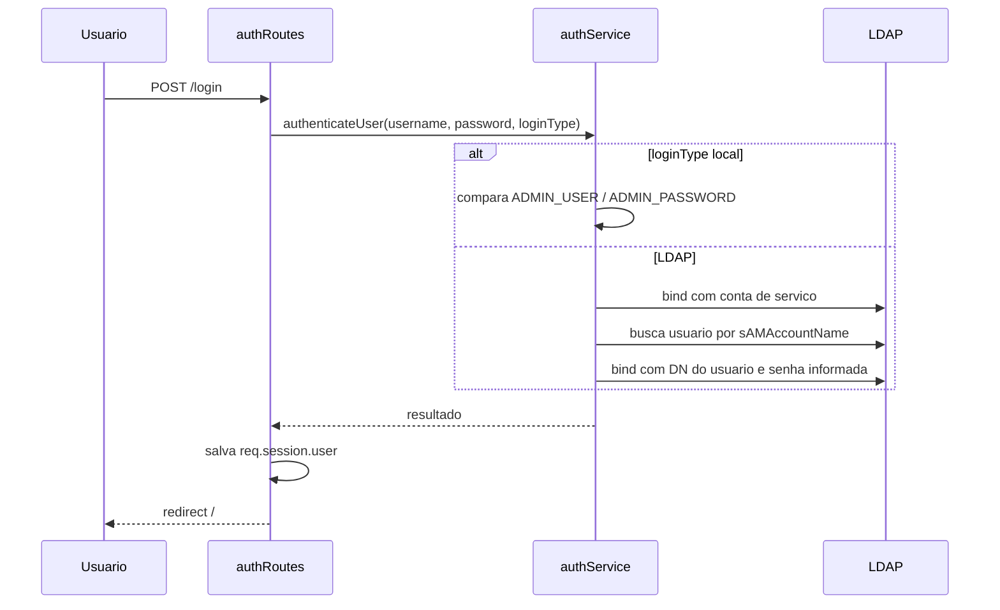

# Arquitetura do PS Panel

Este documento descreve a estrutura e os fluxos atuais do sistema. Regras de implementacao ficam em `docs/patterns.md`.

## Visao Geral

O PS Panel e uma aplicacao web para execucao controlada de scripts PowerShell. A interface permite autenticar usuarios, listar scripts `.ps1`, executar scripts manualmente, consultar historico, configurar parametros globais e criar agendamentos executados por um worker Node.js.

A aplicacao segue uma arquitetura monolitica simples:

- **Backend web** em Node.js com Express.
- **Views server-side** em EJS.
- **Persistencia local** em SQLite.
- **Execucao de automacao** via `powershell.exe`.
- **Autenticacao** local por variaveis de ambiente ou LDAP/Active Directory.
- **Worker de agendamento** separado, acionado por `npm run schedule-worker` ou por uma tarefa externa.

## Componentes Principais



## Pontos de Entrada

### Aplicacao web

O ponto de entrada usado pelo `package.json` e o arquivo `app.js` na raiz:

- `npm start`: executa `node app.js`.
- `npm run dev`: executa `nodemon app.js`.

Esse arquivo configura Express, EJS, assets estaticos, sessoes, flash messages, rotas e inicializacao dos modelos `Settings` e `Schedule`.

Existe tambem `src/app.js`, mas ele parece ser um bootstrap anterior ou alternativo. Ele registra apenas configuracoes e rota de settings, enquanto o `app.js` da raiz concentra a aplicacao completa. Para manutencao, considere tratar `src/app.js` como legado ou consolidar os bootstraps para evitar ambiguidade.

### Worker de agendamentos

O worker fica em `scripts-js/schedule-worker.js` e e executado por:

- `npm run schedule-worker`
- `node scripts-js/schedule-worker.js`
- `scripts-ps/Invoke-ScheduleWorker.ps1`, conforme comentario do proprio worker, tipicamente chamado pelo Windows Task Scheduler.

O worker muda o diretorio atual para a raiz do projeto, inicializa o modelo `Schedule` e chama `Schedule.executeDueJobs(projectRoot)`.

## Estrutura de Diretorios

```text
PSPanel/
├── app.js                    # Bootstrap principal da aplicacao web
├── package.json              # Dependencias e scripts npm
├── public/                   # CSS, imagens e assets servidos pelo Express
├── views/                    # Templates EJS
│   └── partials/             # Partials EJS reutilizaveis, como a sidebar
├── src/
│   ├── controllers/          # Logica de tela/formulario para settings e schedules
│   ├── middleware/           # Middleware de autenticacao
│   ├── models/               # Acesso SQLite e regras de persistencia
│   ├── routes/               # Rotas Express
│   └── services/             # Autenticacao e LDAP
├── scripts-js/               # Utilitarios Node.js e worker de agendamento
├── scripts-ps/               # Scripts PowerShell executaveis pela plataforma
└── database/                 # Banco SQLite local da aplicacao
```

## Camadas e Responsabilidades

### Rotas

As rotas ficam em `src/routes/`:

| Arquivo | Base | Responsabilidade |
| --- | --- | --- |
| `authRoutes.js` | `/` | Login, logout e criacao da sessao de usuario. |
| `mainRoutes.js` | `/` | Tela principal, listagem de scripts e execucao manual. |
| `historyRoutes.js` | `/history` | Consulta do historico e detalhes de execucao. |
| `settingsRoutes.js` | `/settings` | Tela e atualizacao de configuracoes. |
| `scheduleRoutes.js` | `/schedules` | CRUD de agendamentos e auditoria. |

O `app.js` protege as bases `/panel`, `/run-script`, `/history`, `/settings` e `/schedules` com `isAuthenticated`. Algumas rotas tambem fazem checagem propria de sessao, como `mainRoutes` e `historyRoutes`.

### Controllers

Os controllers atuais cobrem principalmente fluxos com formularios:

- `settingsController.js`: carrega e atualiza configuracoes persistidas em SQLite.
- `scheduleController.js`: lista, cria, edita, remove e audita agendamentos.

A execucao manual de scripts ainda esta diretamente em `mainRoutes.js`, incluindo leitura de arquivos, parsing de parametros, chamada do PowerShell e escrita no historico.

### Models

Os models encapsulam persistencia SQLite:

- `History.js`: registra execucoes manuais e agendadas em `database/pspanel.sqlite`.
- `Settings.js`: armazena configuracoes chave/valor em `database/pspanel.sqlite`.
- `Schedule.js`: armazena agendamentos e auditoria em `database/pspanel.sqlite`.

Os models usam a conexao central em `src/database/connection.js`. O schema e inicializado por `src/database/schema.js`, com registro em `schema_migrations`.

### Services

Os services concentram autenticacao:

- `authService.js`: decide entre autenticacao local e LDAP.
- `ldapService.js`: cria cliente LDAP, faz bind e busca usuarios.

A autenticacao local compara `ADMIN_USER` e `ADMIN_PASSWORD` diretamente do ambiente. Embora exista `ADMIN_PASSWORD_HASH` no `.env.example`, o fluxo atual nao usa hash na validacao local.

### Views e partials

As views autenticadas continuam sendo templates EJS completos por pagina. O menu lateral compartilhado fica em `views/partials/sidebar.ejs`.

## Fluxos Principais

### Login



### Execucao manual de script

1. Usuario autenticado acessa `/`.
2. `mainRoutes.js` le `scripts-ps/`.
3. Para cada `.ps1`, a rota tenta extrair:
   - `.SYNOPSIS` do bloco de ajuda PowerShell.
   - bloco `param(...)` para exibir parametros.
4. Usuario envia `POST /run-script` com nome do script e parametros.
5. A aplicacao valida se o arquivo existe em `scripts-ps/`.
6. Cria registro em `script_history` com status inicial `running`.
7. Executa `powershell.exe -File <script> ...args`.
8. Ao finalizar, atualiza historico com saida, erro e status.
9. Retorna HTML simples com `<pre>` contendo a saida.

### Agendamento

1. Usuario cria ou edita agendamento em `/schedules`.
2. `scheduleController.js` valida se o script e um `.ps1` existente em `scripts-ps/`.
3. `Schedule.create` ou `Schedule.update` persiste o agendamento e registra auditoria.
4. O worker periodico chama `Schedule.executeDueJobs`.
5. O model busca agendamentos vencidos e habilitados.
6. Para cada job:
   - aplica lock temporario;
   - registra auditoria `EXECUTE_START`;
   - executa PowerShell com `-NoProfile -ExecutionPolicy Bypass -File`;
   - grava resultado no historico;
   - atualiza `last_run_*`, `next_run_at`, `enabled` e auditoria `EXECUTE_FINISH`.
7. Jobs recorrentes calculam a proxima execucao pela expressao cron de cinco campos no fuso persistido no agendamento.
8. Jobs de execucao unica sao desabilitados apos sucesso.
9. Falhas sao reagendadas para nova tentativa em 5 minutos sem alterar a regra cron.
10. Ocorrencias perdidas sao consolidadas em uma unica execucao quando o worker retorna.

## Persistencia

### `database/pspanel.sqlite`

Banco SQLite local da aplicacao.

### `script_history`

Tabela `script_history`:

| Campo | Uso |
| --- | --- |
| `id` | Identificador da execucao. |
| `script_name` | Nome do script executado. |
| `parameters` | Parametros enviados. |
| `username` | Usuario da execucao manual ou `Agendamento (worker)`. |
| `start_time` / `end_time` | Inicio e fim da execucao. |
| `output` | Saida acumulada. |
| `status` | `running`, `success` ou `error`. |
| `error_message` | Erro retornado pelo PowerShell ou pelo processo. |

### `settings`

Tabela `settings`:

| Campo | Uso |
| --- | --- |
| `key` | Chave pontuada como `scripts.max_execution_time`. |
| `value` | Valor textual. |
| `description` | Campo previsto, mas pouco usado no codigo atual. |

Configuracoes padrao inicializadas:

- `scripts.max_execution_time`: `3600`
- `ui.font_scale`: `100`

### `schedules`

Tabela `schedules`:

| Campo | Uso |
| --- | --- |
| `id` | Identificador do agendamento. |
| `script_name` | Script `.ps1` em `scripts-ps/`. |
| `parameters` | Parametros textuais. |
| `enabled` | Indica se o job esta ativo. |
| `next_run_at` | Proxima execucao em ISO string. |
| `schedule_type` | Tipo `once` para execucao unica ou `cron` para recorrencia. |
| `cron_expression` | Expressao cron de cinco campos para jobs recorrentes. |
| `schedule_timezone` | Fuso IANA usado para interpretar a recorrencia. |
| `worker_lock_until` | Lock para evitar execucoes concorrentes. |
| `last_run_at` / `last_run_exit_code` / `last_run_output` | Ultimo resultado. |
| `created_at` / `updated_at` / `created_by` | Metadados. |

O formulario gera somente expressoes cron semanais suportadas pela aplicacao:
horario fixo, intervalo regular em minutos que divide uma hora ou intervalo
regular em horas que divide um dia. `next_run_at` materializa em UTC a proxima
ocorrencia para manter eficiente a consulta do worker. O fuso inicial usado
pelos agendamentos e `America/Sao_Paulo`.

Tabela `schedule_audit`:

| Campo | Uso |
| --- | --- |
| `id` | Identificador do evento de auditoria. |
| `schedule_id` | Agendamento relacionado, quando aplicavel. |
| `script_name` | Script `.ps1` relacionado ao evento, quando conhecido. |
| `action` | `CREATE`, `UPDATE`, `DELETE`, `EXECUTE_START`, `EXECUTE_ERROR`, `EXECUTE_FINISH`. |
| `username` | Usuario ou worker. |
| `details` | JSON textual com contexto. |
| `created_at` | Data do evento. |

## Rotas HTTP

| Metodo | Rota | Descricao | Autenticacao |
| --- | --- | --- | --- |
| `GET` | `/login` | Tela de login. | Nao |
| `POST` | `/login` | Autentica usuario. | Nao |
| `GET` | `/logout` | Encerra sessao. | Sessao existente |
| `GET` | `/` | Painel principal e scripts disponiveis. | Sim |
| `GET` | `/list-scripts` | Retorna scripts `.ps1` em JSON. | Nao no fluxo atual |
| `GET` | `/render-scripts` | Retorna `<option>` HTML para scripts. | Nao no fluxo atual |
| `POST` | `/run-script` | Executa script manualmente. | Sim |
| `GET` | `/history` | Lista historico paginado. | Sim |
| `GET` | `/history/entry/:id` | Retorna detalhes JSON de uma execucao. | Sim |
| `GET` | `/settings` | Tela de configuracoes. | Sim |
| `POST` | `/settings/update` | Atualiza configuracoes. | Sim |
| `GET` | `/schedules` | Lista agendamentos. | Sim |
| `GET` | `/schedules/new` | Formulario de novo agendamento. | Sim |
| `POST` | `/schedules` | Cria agendamento. | Sim |
| `GET` | `/schedules/:id/edit` | Formulario de edicao. | Sim |
| `POST` | `/schedules/:id` | Atualiza agendamento. | Sim |
| `POST` | `/schedules/:id/delete` | Remove agendamento. | Sim |
| `GET` | `/schedules/audit` | Lista auditoria de agendamentos. | Sim |

## Configuracao

Variaveis relevantes em `.env.example`:

| Variavel | Uso |
| --- | --- |
| `PORT` | Porta HTTP, padrao `3000`. |
| `NODE_ENV` | Define ambiente e cookie secure em producao. |
| `SESSION_SECRET` | Segredo da sessao Express. |
| `ADMIN_USER` | Usuario local. |
| `ADMIN_PASSWORD` | Senha local em texto claro usada pelo fluxo atual. |
| `ADMIN_PASSWORD_HASH` | Existe no exemplo, mas nao e usado no fluxo atual. |
| `LDAP_URL` | Endpoint LDAP. |
| `LDAP_BIND_DN` | Conta de servico para busca. |
| `LDAP_BIND_PASSWORD` | Senha da conta de servico. |
| `LDAP_SEARCH_BASE` | Base LDAP de busca. |
| `LDAP_SEARCH_FILTER` | Existe no exemplo, mas o codigo monta filtro fixo com `sAMAccountName`. |

## Seguranca

Controles existentes:

- Rotas principais protegidas por sessao.
- Scripts executaveis restritos ao diretorio `scripts-ps/`.
- Agendamentos validam nomes `.ps1` sem `..`, `/` ou `\`.
- Worker usa lock por agendamento para reduzir concorrencia.
- Sessao usa `SESSION_SECRET` e cookie `secure` quando `NODE_ENV=production`.

Pontos de atencao:

- A autenticacao local usa senha em texto claro (`ADMIN_PASSWORD`), apesar de haver dependencia `bcryptjs` e `ADMIN_PASSWORD_HASH`.
- `authService.js` registra valores sensiveis em console, incluindo senha local fornecida e configuracoes de autenticacao. Isso deve ser removido antes de producao.
- `scripts-js/check-env.js` imprime o conteudo completo do `.env`, o que pode vazar segredos.
- Parametros de scripts sao separados por espaco simples; nao ha parser robusto de argumentos com aspas/escape.
- A rota manual valida existencia do caminho montado, mas nao rejeita explicitamente nomes com `..`, `/` ou `\` como o fluxo de agendamento faz.
- O retorno de `POST /run-script` injeta saida do processo em HTML. Se scripts retornarem conteudo HTML, ha risco de XSS refletido.
- `LDAP_SEARCH_FILTER` do ambiente nao e aplicado no codigo atual, o que pode surpreender operacao e controle de acesso por grupo.
- `/list-scripts` e `/render-scripts` nao possuem checagem de sessao propria e nao estao cobertas pelo middleware global configurado em `app.js`.

## Operacao

### Subir a aplicacao

```bash
npm install
npm start
```

### Desenvolvimento

```bash
npm run dev
```

### Executar worker de agendamentos

```bash
npm run schedule-worker
```

Em Windows, a intencao aparente e chamar `scripts-ps/Invoke-ScheduleWorker.ps1` pelo Task Scheduler a cada 5 minutos.

## Observacoes Tecnicas

- O projeto nao possui testes automatizados configurados; `npm test` apenas retorna erro.
- Existem arquivos SQLite versionados/modificados no workspace, o que pode misturar estado local com codigo.
- O README menciona HTMX e Font Awesome, mas essas dependencias nao aparecem no `package.json`; podem estar carregadas pelas views/CDN ou ser documentacao desatualizada.
- O model `Schedule` concentra tanto persistencia quanto execucao de PowerShell. Isso funciona para o tamanho atual, mas dificulta testar isoladamente a regra de agendamento.

## Recomendacoes de Evolucao

1. Consolidar o bootstrap em um unico arquivo (`app.js` ou `src/app.js`) e remover/arquivar o outro.
2. Migrar autenticacao local para `ADMIN_PASSWORD_HASH` com `bcryptjs` e remover logs sensiveis.
3. Extrair execucao de PowerShell para um service compartilhado entre execucao manual e agendada.
4. Padronizar validacao de nomes de scripts nos fluxos manual e agendado.
5. Escapar saida de scripts antes de renderizar HTML.
6. Adicionar testes focados para parsing de scripts, validacao de agendamentos e calculo de proxima execucao.
7. Avaliar se arquivos SQLite devem permanecer versionados ou ser tratados como dados locais/ambiente.
